---

# Advanced Parts Management Software: Revolutionizing Equipment Maintenance Efficiency

## Introduction

In equipment maintenance, where every second of downtime can be costly, efficiency and accuracy are paramount. Technicians need to identify, locate, and manage parts quickly and precisely. Our **Advanced Parts Management Software** does just that—streamlining parts and equipment management to enable faster, smarter work. This comprehensive software provides centralized data, automated processes, and user-friendly tools, empowering your team to tackle maintenance challenges with unparalleled efficiency.

---

## **1. Parts Books Tab**

### Purpose

The **Parts Books Tab** serves as the central repository for accessing detailed parts books tailored to each machine. Each book includes essential columns such as stock numbers, descriptions, and reference figures. This data is organized in a way that streamlines parts identification and retrieval, ensuring technicians can quickly find what they need without sifting through multiple resources.

![[Pasted image 20241112112945.png]]
_FIGURE 1.1 Parts Books Tab_

![[Pasted image 20241112214752.png]]
_Figure 1.2 Parts Book Sample (AFCS200)_
![[Pasted image 20241113064159.png]]
_Figure 1.3 Parts Room Sample_

### Distinctions Between Parts Books and Parts Room Files

While the **Parts Room** file consolidates information across all parts books for a holistic view, each **Parts Book** file focuses on the unique data relevant to a specific machine. This targeted structure provides efficiency and precision when working on individual machines.

### Column Breakdown in Parts Book Files

#### Key Columns

- **NO.**: This column lists the part number within the specific figure referenced in the **REF.** column. It allows technicians to directly correlate the part with its illustration in the handbook, making it easy to identify within diagrams.

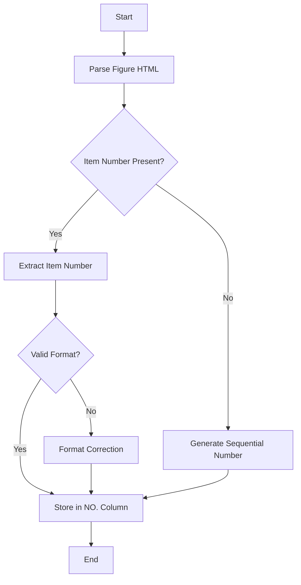
_Figure 1.4 NO. Column Logic_

- **STOCK NO.**: Displays the standardized **NSN** or **NSL** (Not Stocked Locally) label. NSNs allow cross-referencing with the national stockroom, while NSLs identify parts that may not be immediately available but can be sourced or ordered as needed.

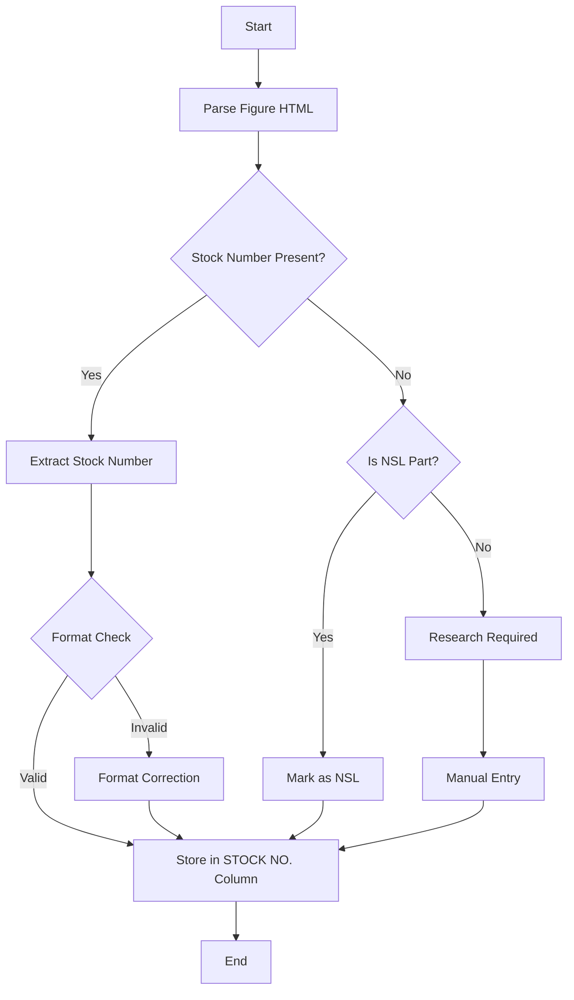
_Figure 1.5 NSN Column Logic_

- **PART DESCRIPTION**: Contains detailed information about the part, such as specifications (e.g., "Screw, cap, hexagon head, steel, zinc coated, class 8.8, M8 x 1.25 x 30 mm long"). This ensures that technicians can verify they are selecting the correct part without ambiguity.

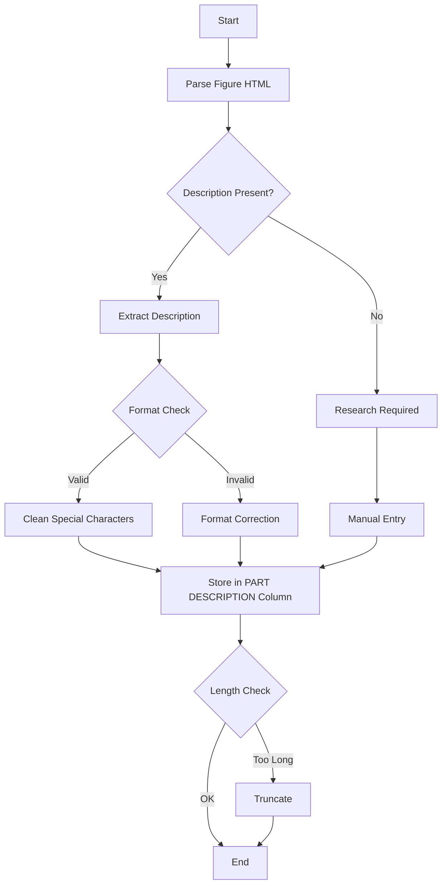
_Figure 1.6 Description Column Logic_

- **PART NO.**: This column lists the OEM information. It allows easy cross-referencing with suppliers and manufacturers.

- **REF.**: Specifies the figure references (e.g., "Figure 2-10") within the handbook where the part can be found. This column is essential for directing technicians to the exact figure that includes the part, saving time and reducing errors.

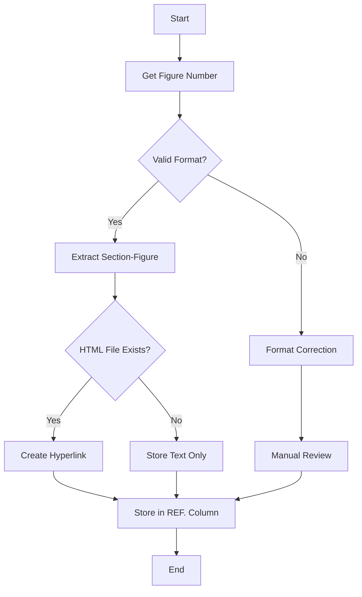
_Figure 1.7 Reference Column Logic_

- **QTY**: Indicates the quantity on hand or required, streamlining inventory planning and ensuring that parts are in stock or requested in advance.

- **LOCATION**: Shows the storage location or notes that a part is not stocked locally, aiding in quick retrieval or sourcing decisions.

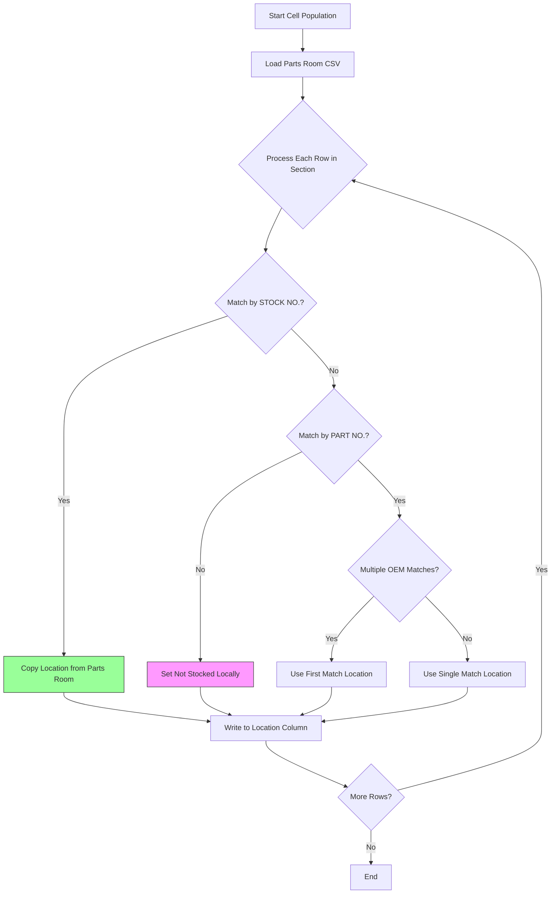
_Figure 1.8 Location Column Logic_

- **CAGE**: Provides the Commercial and Government Entity (CAGE) code, essential for identifying the part's manufacturer or supplier.

### Column Breakdown in Parts Room Files

#### Key Columns

- **PART NO.**: Identifies the unique part number associated with each item. This enables quick cross-referencing between parts books and inventory files to ensure the correct part is available.

- **DESCRIPTION**: Details the part characteristics, such as type and specifications. It’s crucial for ensuring technicians have the necessary information for parts selection.

- **STOCK NO.**: Lists the National Stock Number (NSN) if applicable. This column is essential for inventory verification and identifying parts that align with national standards.
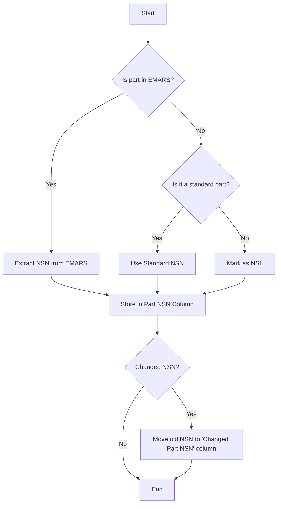
_Figure 1.9 STOCK NO. Column Logic_

- **QTY**: Displays the quantity on hand, facilitating inventory tracking and restocking when necessary.

- **LOCATION**: Indicates where the part is stored within the facility or notes that it is not locally stocked, aiding in efficient retrieval and stock tracking.

- **CAGE**: Lists the Commercial and Government Entity (CAGE) code for the part’s supplier, essential for sourcing and procurement.

- **New Parts Book Reference Columns**: Columns that allow a user to quickly cross-reference between the Parts Volume and his Site. Particularly useful when you have a part you need to replace and the only part number you can find is on a part nearby. 

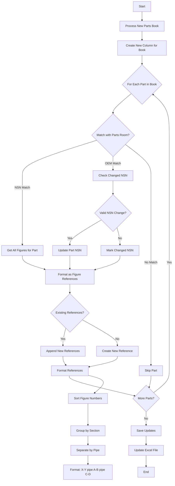
_Figure 1.10 Book Reference Column Logic_

---
### Dynamic Integration with the Parts Room File

When a new parts book is created, its name is added as a column in the **Parts Room** file. This enables technicians to see, at a glance, which parts appear across different machines and specific figures within each book. For example, if a part is featured in multiple figures within a book, these figures (e.g., "Figure 2-11 | Figure 2-8") are populated in the respective book-specific column. This helps technicians focus on relevant sections, saving valuable time during diagnostics and repair.

### Benefits

- **Targeted Information Access**: Enables technicians to quickly locate machine-specific data within each parts book.
  
- **Enhanced Cross-Referencing**: With book-specific columns in the **Parts Room**, technicians can see exactly which figures to consult, improving efficiency and accuracy.

- **Simplified Navigation**: Figure references in the **Parts Book** files link directly to the parts diagrams, minimizing the time spent navigating complex manuals.

---

## **2. Call Logs Tab**

### Purpose

The **Call Logs Tab** provides structured access to service calls, ensuring efficient maintenance tracking. It logs essential call details, updates statuses, and automates labor transfers, ensuring that crucial data is always available for analysis.

### Key Features

- **Recent Calls List**: Displays machine identifiers, causes, actions, timestamps, and notes, keeping the team informed about issues and resolutions in real time.
  
- **Automatic Labor Log Transfer**: Moves calls over 30 minutes into the **Labor Log Tab** for more detailed tracking. This automation ensures that significant maintenance activities are captured without extra steps.
  
- **End-of-Shift Reporting**: Simplifies the reporting process by consolidating all calls and activities at the end of each shift. This feature encourages technicians to accurately document calls, enhancing long-term data reliability.

![[Pasted image 20241114045740.png]]
_Figure 2.1 Call Logs Tab_
### Benefits

- **Improved Communication**: Keeps team members updated on equipment status, preventing miscommunications.
  
- **Efficient Documentation**: Automates logging for convenience and accuracy.
  
- **Enhanced Accountability**: Tracks every action, supporting performance assessments.

![[Pasted image 20241114045932.png]]
_Figure 2.2  Call Log Adding Window_

![[Pasted image 20241114050252.png]]
_Figure 2.3 Adding a new machine to the options for calls_

---

## **3. Labor Log Tab**

### Purpose

The **Labor Log Tab** is a powerful tool for creating work orders, tracking parts usage, and enabling detailed records. It includes search capabilities designed for parts retrieval and is integrated with EMARS for seamless work order management. Any Call Log that is over 30 minutes gets moved to the Labor Log view as well and tells the user that they need a work order number. This also allows them to utilize the adding of parts.

![[Pasted image 20241115030201.png]]
_Figure 3.1 Labor Log Tab_
### Key Features

- **Create Work Orders**: With fields for the **Date**, **Work Order**, **Description**, **Machine**, **Duration**, **Parts**, and **Notes** work orders are auto-populated with the parts database. Technicians can then add work-specific details and seamlessly integrate with EMARS.

![[Pasted image 20241115030401.png]]
_Figure 3.2 Adding a labor log_

- **Search for Parts**: The built-in parts search saves technicians time by enabling quick retrieval from the current parts database.

![[Pasted image 20241115030646.png]]
_Figure 3.3 Searching for a part_

![[Pasted image 20241115030818.png]]
_FIgure 3.4 Adding a part to a work order_

![[Pasted image 20241115030954.png]] 
_Figure 3.5 Prompt to add part. This will come up for each part._

![[Pasted image 20241115031155.png]]
_Figure 3.6 Once you have selected you parts it populates_

![[Pasted image 20241115031436.png]]
_Figure 3.7 How it populates the parts it goes_ <NSN><(quantity)>-<Location>, <NSN><(quantity)>-<Location>

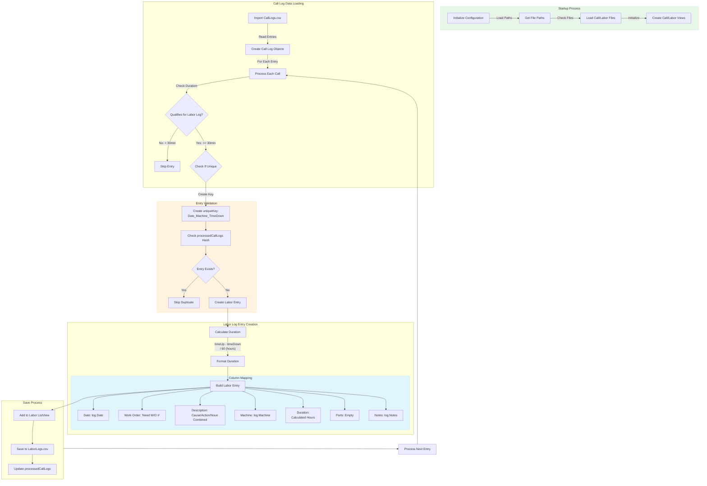
_Figure 3.8 How call logs are moved and how columns are populated_

The most important parts are color-coded:
- Green: Initialization process
- Blue: Column mapping
- Orange: Validation process
  
  - **Enhance Reporting** with data for audits and budgeting.
### Benefits

- **Comprehensive Tracking**: Ensures complete, accurate labor logs.
  
- **Time Savings**: Simplifies work order creation and documentation.
  
- **Data Insights**: Offers historical data to improve maintenance planning.

---

## **4. Actions Tab**

### Purpose

The **Actions Tab** serves as a **temporary hub** for actions that have not yet been assigned to specific tabs but remain integral to the workflow. It also includes features that connect and streamline various components of the program. This ensures ongoing functionality while providing a centralized workspace for fast, automated tasks.

![[Pasted image 20241115033215.png]]
_Figure 4.1 Quick look at the Actions tab_

### Key Features
- **Workflow Bridge**: Facilitates steps that involve multiple features of the software, tying together interconnected processes in a single interface.
---

## **5. Search Tab**

### Purpose

The **Search Tab** offers flexible, fast search capabilities for technicians. Parts can be located using NSNs, OEM numbers, or descriptions, significantly speeding up parts retrieval.

### Key Features

- **Wildcard Search**: Enables flexible search terms with wildcards, allowing technicians to find parts even with incomplete data.
  
- **Cross-Reference Capabilities**: Cross-references NSNs with OEM numbers and descriptions, providing all possible options.
  
- **Multi-Location Search**: Extends searches to local and national stockrooms and nearby facilities, improving the chances of finding parts quickly.
  
- **Cross-Referenced Figures**: For parts in multiple handbooks, results show relevant figures and allow quick access. This feature reduces manual handbook navigation drastically.

### How it works:

# Search Pattern Reference

## Cross Reference Search Specifics
| Field | Search Target | Notes |
|-------|--------------|-------|
| NSN | STOCK NO. | Matches against Parts Books' STOCK NO. field |
| Part No | PART NO. | Matches against Parts Books' PART NO. field |
| Description | PART DESCRIPTION | Matches against Parts Books' PART DESCRIPTION field |

## Cross Reference Display Fields
| Field | Source | Description |
|-------|--------|-------------|
| REF | Section reference | From Parts Book section reference |
| STOCK NO. | Parts Book data | NSN from Parts Book |
| PART NO. | Parts Book data | Manufacturer part number |
| Location | Parts Book data | Location if available |
| QTY | Not applicable | Cross reference doesn't track quantity |

## Cross Reference Search Behavior
- Searches all sections in all configured Parts Books
- REF numbers preserved for figure lookup
- Matches must meet all provided search criteria (AND logic)
- Empty search fields match all entries in that field
- Search is performed across all configured Parts Books simultaneously
- Results include book and section information for reference

## View-Specific Search Comparisons
| Feature | Main Parts Room | Same Day Parts | Cross Reference |
|---------|----------------|----------------|-----------------|
| Source Display | CSV Name | Site Name | Book Name |
| QTY Available | Yes | Yes | No |
| Location Info | Current | Current | From Manual |
| Part Number Source | OEM Fields | OEM Fields | PART NO. Field |
| NSN Format | Current | Current | Manual Format |
| Results Update | Real-time | Real-time | Static |

## Search Field Interactions Across Views
| Search Type | Main Parts Room | Same Day Parts | Cross Reference |
|------------|-----------------|----------------|-----------------|
| NSN Only | Searches Part (NSN) | Searches Part (NSN) | Searches STOCK NO. |
| Part No Only | Searches OEM fields | Searches OEM fields | Searches PART NO. |
| Description Only | Searches Description | Searches Description | Searches PART DESCRIPTION |
| Combined | AND logic between fields | AND logic between fields | AND logic between fields |

## Important Notes:
1. All three views are searched simultaneously
2. Each view maintains its own result set
3. Cross Reference results don't include quantity information
4. Location information means different things in different views
5. Part numbers are matched differently in Cross Reference vs. other views
6. Results are displayed in separate sections of the interface
7. Search terms are applied consistently across all views but may match different fields

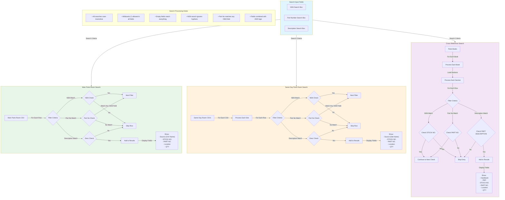
![[Pasted image 20241115071149.png]]
#### _OEM Search Example_

![[Pasted image 20241115071608.png]]
#### _NSN Search Example_

![[Pasted image 20241115072114.png]]
#### _Description Search Example_

![[Pasted image 20241121220445.png]]
![[Pasted image 20241121221124.png]]

By selecting any number of parts and clicking "Open Figures" it will open directly to the drawing. This is much, much faster than navigating slowly through the website. I can put in a partial number or a number of a nearby part and open, instantly, any drawing I suspect that could be helpful.
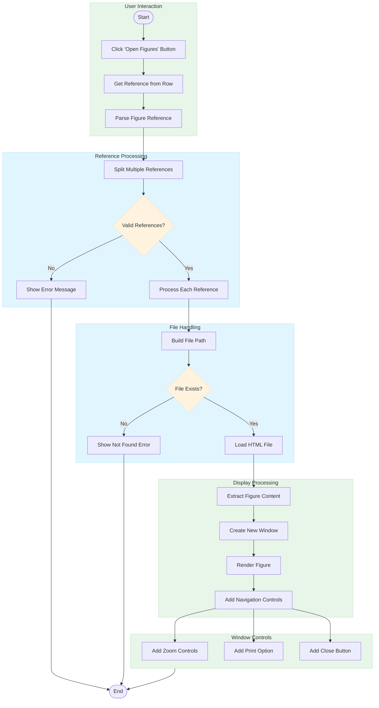

### Benefits

- **Speed**: Reduces time spent finding parts by over 90%.
  
- **Accuracy**: Increases accuracy with detailed, cross-referenced results.
  
- **Convenience**: Combines all search functions into one interface.

---

## **6. Optimized Workflow for Parts Search**

### The Transformation

Our software redefines the time-intensive parts identification workflow by providing a seamless, end-to-end solution.

#### Old Workflow Process (50–92 minutes per task):

1. **Identify Issue on Machine**: Inspect machine to determine the issue.
   
2. **Access ACE Computer**: Locate and use a dedicated ACE computer to access parts and repair information.
   
3. **Navigate to MTSC Website**: Find machine acronym link and relevant handbook.
   
4. **Identify Handbook and Section**: Manually locate correct section.
   
5. **Identify the Part**: Scroll through sections to locate specific part information.
   
6. **Locate Part in National Stockroom Database**: Search by NSN, OEM, or description.
   
7. **Check Other Facility Part Rooms** if unavailable locally.
   
8. **Order Part**: Submit a request to parts clerk.
   
9. **Document Call Log**: Record the issue, actions taken, and time manually.

#### New Workflow with Advanced Parts Management Software (Under 10 minutes per task):

1. **Diagnose Issue**: Use historical data from the **Call Logs Tab**.
   
2. **Search for Part**: Instantly search by any known identifier.
   
3. **Access Detailed Part Information**: View parts data with cross-referenced figures in the **Parts Books Tab**.
   
4. **Check Stock Availability**: See real-time stock levels and locations in the **Parts Room**.
   
5. **Order Part**: Use the **Actions Tab** to order the part immediately if out of stock.
   
6. **Automated Logging**: Automatically updates **Call Logs**

 and **Labor Logs**.

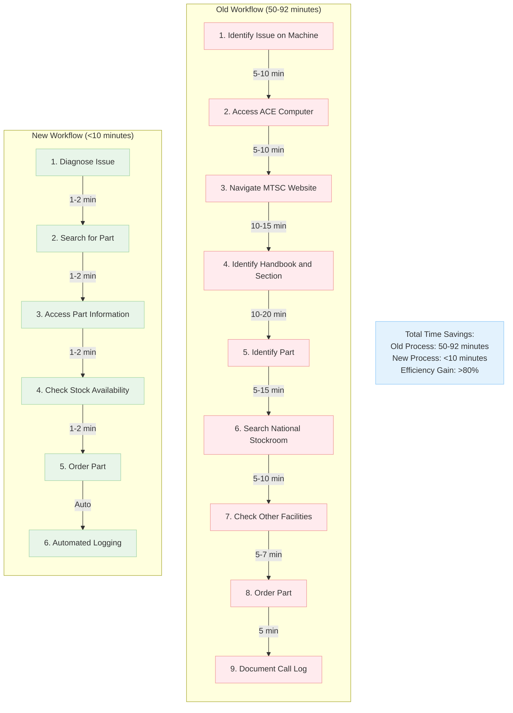

### Time Saved

- **Old Workflow**: 50-92 minutes per task.
  
- **New Workflow**: Under 10 minutes per task

---

## **7. Windows PowerShell Integration**

### Purpose

The software leverages Windows PowerShell scripts to automate complex tasks, including data imports, HTML processing, and Excel report generation, reducing manual intervention and enhancing accuracy.

### Key Features

- **Automated Data Handling**: Scripts streamline data extraction and updating, ensuring the latest data is always accessible.
  
- **Dynamic Parts Books Generation**: Scripts automate Excel creation for each new book, keeping data current with minimal manual input.
  
- **Error Handling and Notifications**: Notifications immediately inform users of any issues, supporting a smooth experience.

*Template location*: *Include a diagram showing how PowerShell scripts automate data flow.*

### Benefits

- **Improved Accuracy**: Reduces the risk of data entry errors.
  
- **Efficiency**: Automates data handling, freeing staff to focus on essential tasks.
  
- **Scalability**: Allows the system to grow with ease, adapting to new machines, parts, or handbooks as needed.

---

## **Conclusion**

Our **Maintenance Assistance Software** is a transformative solution that not only manages parts but optimizes your entire maintenance workflow. Each feature is designed with technicians’ needs in mind—from the **Parts Books Tab** that centralizes all parts data, to the intelligent **Search Tab** that significantly reduces search times. Future enhancements, such as the planned historical labor search, will provide even deeper insights for long-term analysis and reporting.

Invest in this system to reduce downtime, cut costs, and improve operational efficiency—taking your maintenance operations to new heights.

---